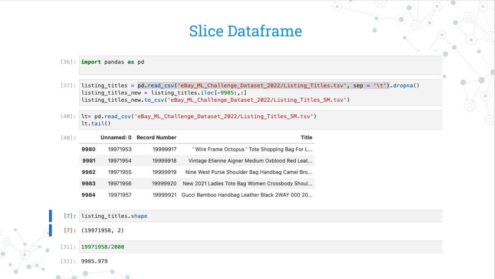
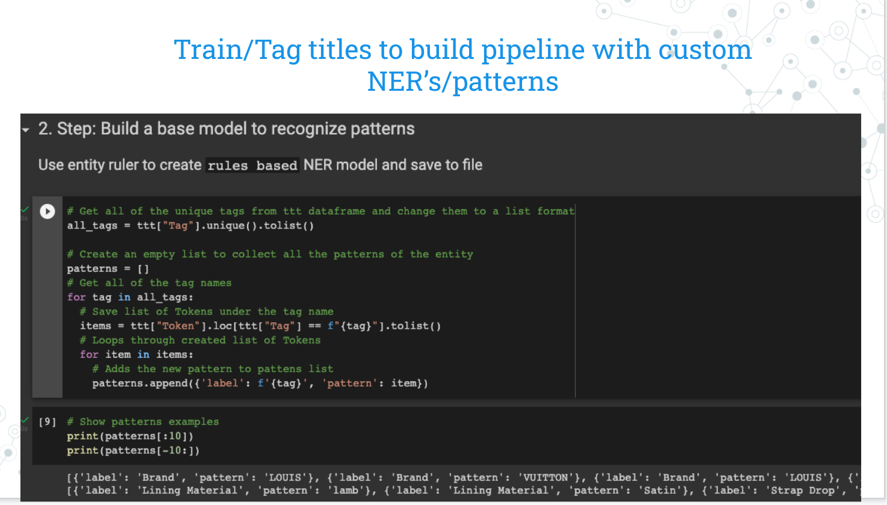
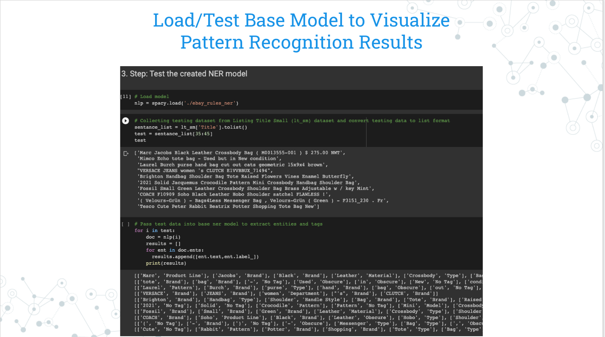
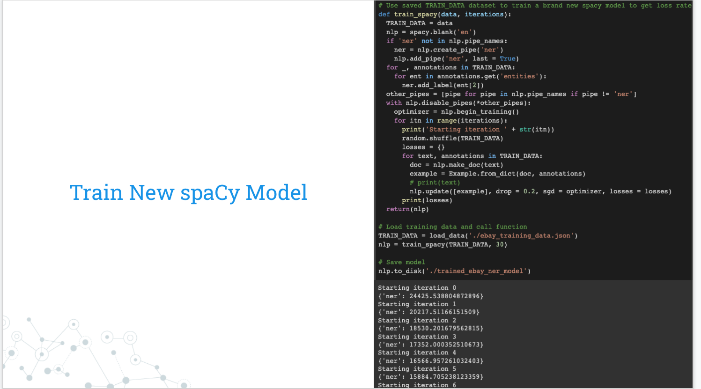
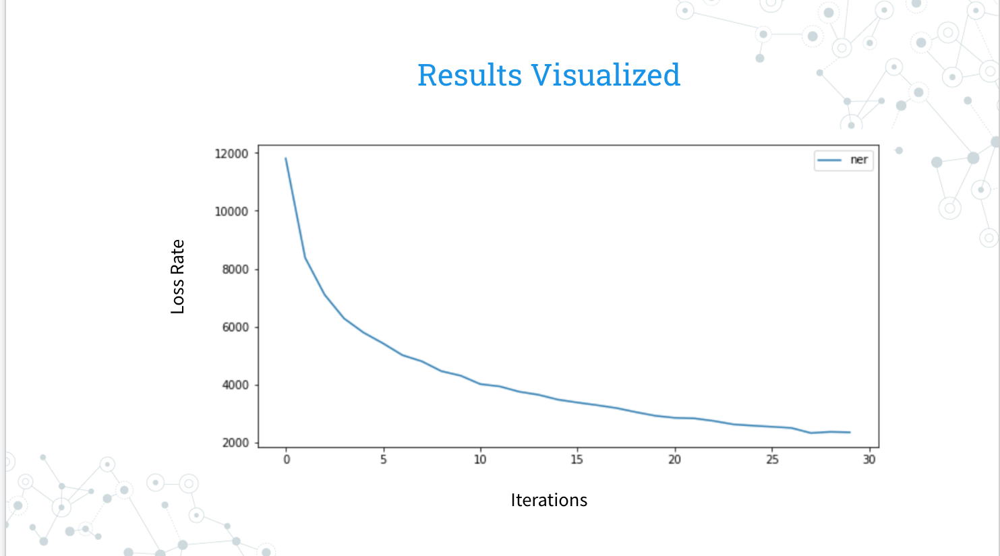
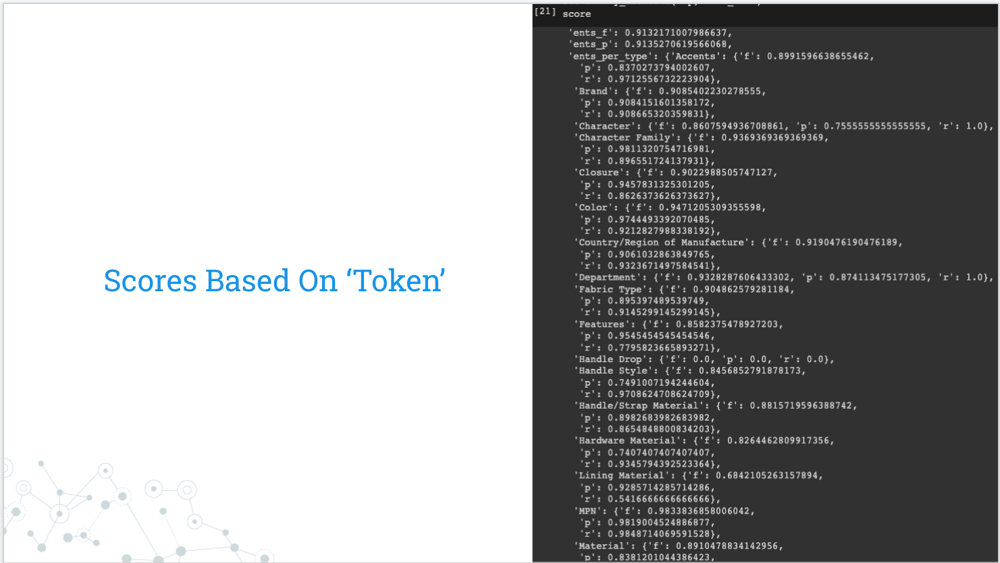
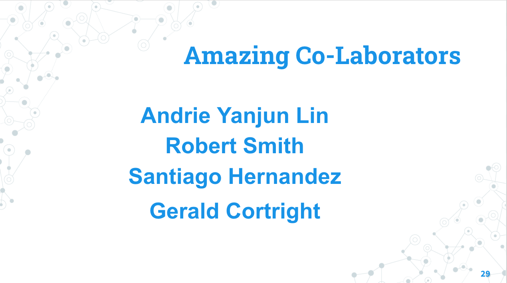

`Natural Language Processing` (NLP), **Named Entity Recognition** (NER) is a fundamental task to identify the key elements in a text. Extracting the main entities in a text helps sort unstructured data and detect important information, which is crucial if you have to deal with large datasets

## EBAY COMPETITION 2022
*Named entity recognition (NER)*

>👨🏿‍⚖️ [click here](https://eval.ai/web/challenges/challenge-page/1733/overview) to access **ebay competition page**

`Ebay Data Set`
Approximately **20 million** randomly selected unlabeled item titles from eBay

Among these item titles there will be approximately 10,000 labeled item titles (“labeled” means the aspects have been extracted)

 > Train_Tag_Title (‘ttt’) - 30K lines 
 
 > Listing_Title (‘lt’) - 20M Lines 

#  STEP 1

>👨🏿‍⚖️ `The shape` of a DataFrame is a tuple of array dimensions that tells the number of **rows and columns** of a given DataFrame

# STEP 2

>👨🏿‍⚖️ This Project uses `RULE BASED APPROACH` [click here](https://towardsdatascience.com/linguistic-rule-writing-for-nlp-ml-64d9af824ee8) to learn more

# STEP 3

>👨🏿‍⚖️ We now know our `NER model` work [click here](https://monkeylearn.com/blog/named-entity-recognition/) to learn more about NER

# STEP 4

>👨🏿‍⚖️ [click here](https://spacy.io/usage/spacy-101#:~:text=spaCy%20is%20designed%20specifically%20for,process%20text%20for%20deep%20learning.) to learn more about Spacy

* In each iteration the `loss rate` decreases

# STEP 5

>👨🏿‍⚖️ Evaluate F1 score to improve accuracy [click here](https://spacy.io/api/scorer) to learn how to get **score** in `Spacy` 

# REQUIREMENTS

>👨🏿‍⚖️  Click name to download

[PYTHON](https://www.python.org/downloads/)

[PANDAS](https://pandas.pydata.org/)

[Spacy](https://spacy.io/usage)

# INSTALLATION

>👨🏿‍⚖️ Install zip file  or Clone repo

[click here](https://github.com/brprod8/EBAY_NLP-/archive/refs/heads/main.zip) for zip file

[click here](https://github.com/brprod8/EBAY_NLP-)for clone repo

# LICENSE

